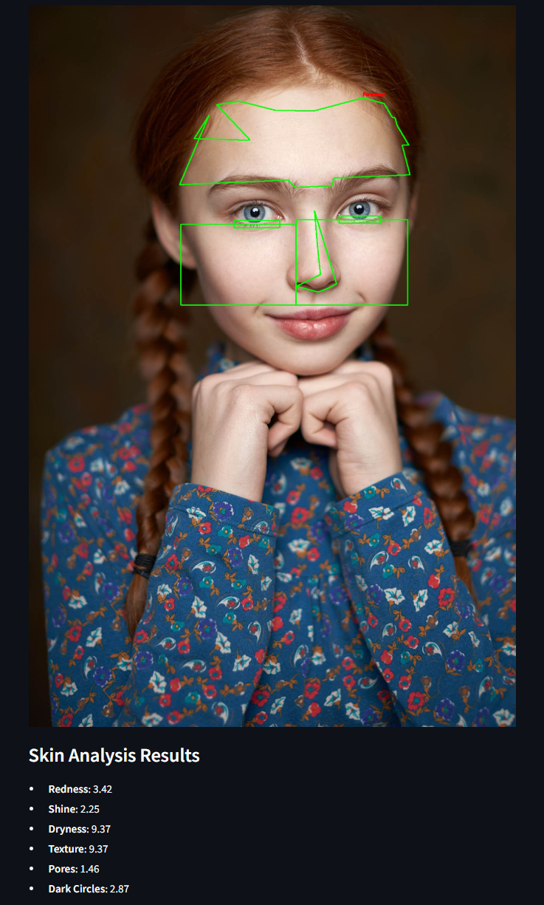

# Skin Analysis Tool

A Streamlit-based application that analyzes uploaded facial photos and generates scores (1-10) for:
- Redness
- Glow
- Dryness
- Texture
- Pores
- Dark circles

## Requirements

- Python 3.8 or higher
- conda (recommended) or pip
- dlib's 81-point shape prediction model: Download `shape_predictor_81_face_landmarks.dat` from [this GitHub repository](https://github.com/codeniko/shape_predictor_81_face_landmarks) and place it in the project root directory.

## Installation

### 1. Set Up Conda Environment (Recommended)
```bash
conda create -n skin_analysis_app python=3.8
conda activate skin_analysis_app
```

### 2. Clone and Prepare the Repository
```bash
git clone https://github.com/Mingyang0018/skin_analysis_app.git
cd skin_analysis_app
git clone https://github.com/codeniko/shape_predictor_81_face_landmarks.git
```

### 3. Install Dependencies
```bash
# Using pip
pip install -r requirements.txt

# Or using conda (if available)
conda install --file requirements.txt
```

**Note for Windows users**: Installing dlib may require additional setup:
1. Install CMake: `conda install -c anaconda cmake`
2. Install C++ compiler tools
3. Alternatively, download precompiled `.whl` files from [this repository](https://github.com/z-mahmud22/Dlib_Windows_Python3.x) and install using `pip install <wheel_file>`

## Usage

1. Activate your conda environment (if used):
   ```bash
   conda activate skin_analysis_app
   ```

2. Run the application:
   ```bash
   streamlit run skin_analysis_app.py
   ```

3. Open the displayed URL in your browser (typically `http://localhost:8501`)

4. Upload a clear facial photo to view the analysis results

## Example
