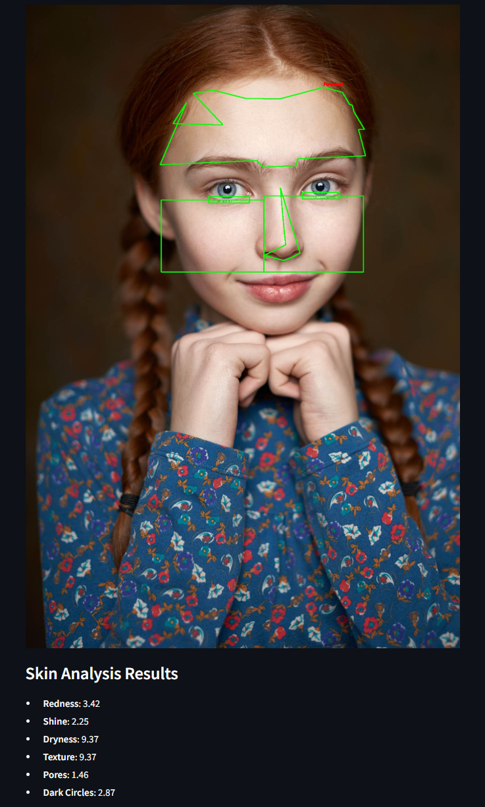

# 皮肤分析工具

这是一个基于 Streamlit 的应用程序，通过分析用户上传的面部照片，生成红斑、光泽、干燥、纹理、毛孔和黑眼圈的评分（1-10 分）。

## 要求

- Python 3.8 或更高版本
- dlib 的 81 点形状预测模型：从 [此 GitHub 仓库](https://github.com/codeniko/shape_predictor_81_face_landmarks) 下载 `shape_predictor_81_face_landmarks.dat`，并将其放置在项目根目录。

## 安装

1. 创建虚拟环境（建议）
   ```
   conda create -n skin_analysis_app python=3.12
   conda activate skin_analysis
   ```
2. 克隆代码仓库：
   ```
   git clone https://github.com/Mingyang0018/skin_analysis_app.git
   cd skin_analysis_app
   git clone https://github.com/codeniko/shape_predictor_81_face_landmarks.git
   ```
3. 安装依赖：
   ```
   pip install -r requirements.txt
   ```

**Windows 用户注意**：安装 dlib 可能需要额外配置，例如安装 CMake 和 C++ 编译器。从 [此仓库](https://github.com/z-mahmud22/Dlib_Windows_Python3.x) 下载预编译的 `.whl` 文件并使用 `pip install <wheel_file>` 安装。

## 使用

1. 运行应用程序：
   ```
   streamlit run skin_analysis_app.py
   ```
2. 在浏览器中打开显示的 URL（通常为 `http://localhost:8501`）。
3. 上传一张清晰的面部照片，查看分析结果。

## 示例
